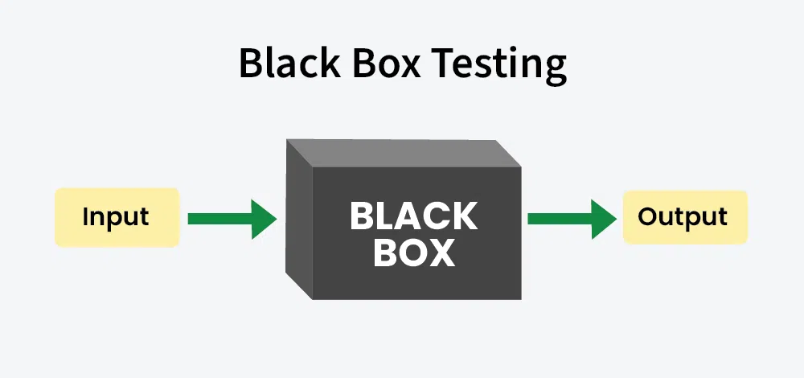
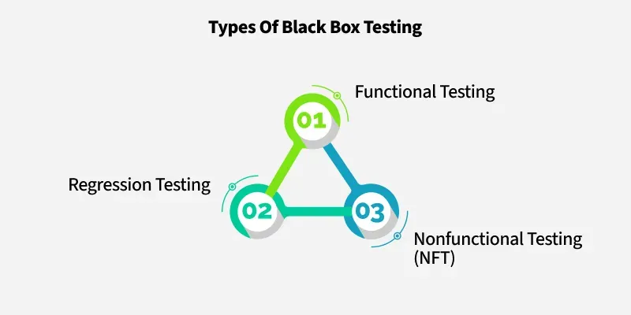
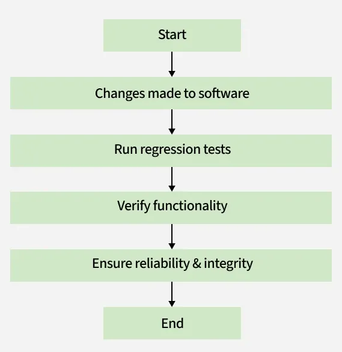
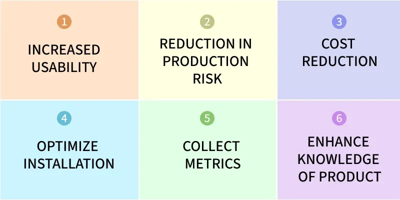
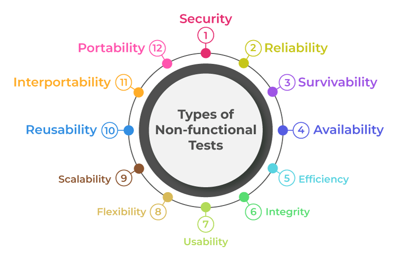

# Software Testing Overview

## What is Software Testing?
Software testing is the process of verifying that the developed software/application fulfills all the client-required functionalities.

There are two main approaches:

1. **Manual Testing** – Verifying an application without using any automated tool/software.
2. **Automation Testing** – Verifying an application/software with the help of automated tools/software.

---

## SDLC (Software Development Life Cycle)

Key roles:
- **BA (Business Analyst)** – Service based
- **PO (Product Owner)** – Product based

### SDLC Phases
1. Requirement Gathering
2. Designing Phase
3. Implementation/Development Phase
4. Testing Phase
5. Delivery/Deployment Phase
6. Maintenance Phase

---

## STLC (Software Testing Life Cycle)

### STLC Phases
1. Requirement Gathering
2. Test Planning & Test Case Creation
3. Test Environment Setup
4. Test Case Execution Phase
5. Defect Logging
6. Test Cycle Closure

### Deferred :-
When any issue which is not impacting the major functionalities  of application so in that case 
developer said we will fixed that into the next version.

### Duplicate :-
When any bug is already raised  incorporate  with another  issue so that  is called duplicate condition..

## Bug/Defect Life Cycle 
 1. **New**
 2. **Assign to Dev**
 3. **open**  
 &nbsp;  &nbsp; ***Deferred***  
 &nbsp;  &nbsp; ***Duplicate***  
 &nbsp;  &nbsp;  ***Rejected***  
 

4.**Fixed**  
5.**Retesting**  
6.**Verified**   
7.**Closed**    

---

## Test Plan Document Structure
1. Introduction
2. Objective
3. Testing Approach
4. Test Strategies
5. Test Deliverables
6. Entry & Exit Criteria
7. Estimations
8. Risk & Mitigation Plan
9. Conclusion

---

## Test Case Examples
- To verify by entering valid credentials
- To verify by entering invalid credentials
- To verify by entering a valid user and invalid password

---

---
## Lecture 3

### Bug
- All the issues which is found during testing enviroment known as bug..

### Defect
- All the issues which is found over production enviroment known as defect.

### Error
- All the compile time issues are known as errors.

## Bug Report

- Project name -->XYZ
- Summary --> user is not able to logged in.
- Interface-->Login
- Module --> Login
- Enviroment -->Testing
- Description -->
   (A) Problem Statement:-User is not able to logged in with valid credentials.
   (B)Steps to reduce-->Open the url > click on login button > Enter valid credentials > click on submit.

- Labels/Watcher -->XYZ
- Assignee-->Dev XYZ
- Priority-->Highest/Low/Medium
- BA-->XYZ
- Click on Create Btn.
## Test Case Documentation 

## Jira
Jira is a versatile project management and issue-tracking software developed by Atlassian that helps teams plan, track, and manage their work throughout the software development lifecycle. It supports various agile methodologies, such as Scrum and Kanban, offering features like customizable boards, roadmaps, and reports. While widely used by software development and IT teams for bug tracking and planning, Jira's flexibility allows other departments like marketing, design, and operations to use it for project management and workflow customization. 

### Key Features and Uses
1. **Agile Project Management:**
- Jira provides the tools for agile frameworks, including Scrum and Kanban boards, to visualize and manage workflows. 
2. **Bug and Issue Tracking:**
- It offers robust features to track bugs, manage tasks, and resolve issues efficiently, serving as a centralized system for tracking project-related problems. 
3. **Customizable Workflows:**
- Teams can create custom workflows to align with their specific project needs and processes. 
4. **Planning and Roadmaps:**
- Jira allows teams to create roadmaps, set goals, track dependencies, and break down large projects into smaller, achievable steps. 
5. **Reporting and Dashboards:**
- It provides various reports and dashboards to give teams visibility into their work and enable data-driven decision-making. 
6. **Integrations and Extensibility:**
- Jira integrates with numerous other development and business tools, enhancing its functionality through a wide ecosystem of apps and add-ons. 

### Who Uses Jira?
- Software Development Teams: For planning, tracking, and releasing software. 
- IT Teams: For managing IT projects and service requests through products like Jira Service Management. 
Product Management Teams: To create product roadmaps and manage the product lifecycle. 
- Marketing Teams: For planning and tracking campaigns. 
- Other Business Functions: Including finance, human resources, design, and operations, leveraging Jira for general project and task management. 

### BA--> Task (Epic) Need to Develop then e-commerce
- Epic and user story  is the jira's vocab 

#### subtask (User Story)
 - develop the login functionality
 - develop the category pages
 - develop the order flow 
 - develop the payment methods

## Agile
- Agile is a methodology  which is used to make the continous itration between testing and development..

## FrameWork
- A framework is a reusable structure of pre-written code, tools, and guidelines that provides a foundational blueprint for developing software applications, websites, and IT systems. 
Frameworks simplify development by handling common tasks and enforcing best practices, allowing developers to focus on the unique functionalities of their project instead of repetitive, low-level coding. This leads to faster development, more organized code, and more scalable, maintainable applications.

## What are the frameworks in agile??
- Scrum framework
- Kanban framework
- Extreme Programming (XP)

## What is Sprint ??
- some sets of UserStory (subTask) which needs to be completed  within  a set time duration.
- Sprint duration will be 2 -4 weeks,also we can't extend the sprint time.
- Sprint time duration is related to company norms e.g (some company have 2 weeks sprint duration or 4 weeks).
- sprint time duration is not extended .

Sprint like Groups

eg.... 

### Spill Over 
- All the User Story are delivered as per time  duration  except  one user story w/o impacting the deadline 
is known as Spill over. 

## What are the different ceremonies (Meetings) in Agile/Scrum ?
1. **Sprint Planning** in this we will make the plan for the current sprint sprint that what are the user story should cover and what are the resources  required in this sprint.

2. **Scrum/DSM Meeting(Daily Standup Meeting)** In this we had a discussion about the daily task what we have done and what we needs to be done for today.

3. **Sprint Review** In this  we had a discussion about the current sprint that can we complete it within in time or not ? if we can't so how we overcome this situation.

4. **Sprint retrospective/Conclusion** This will happen at the last in this we had discussion about the current sprint that what went wrong and what went good in this and if face any chalanges so how we can overcome those.

# Lec 6

## What is Sprint and product backlog
1. **Product backlog:-**Work which is remaining to be completed   in the product/application.    
1. **Sprint backlog:-**Work which is remaining into the particular sprint known as sprint backlog.

## what is Burn Up and Burn Down
1. **Burn Up** Work which has been completed shown as Burn Up chart.
1. **Burn Down** Work which has remaining to be completed shown as Burn Down chart.

## What is Velocity ??
- the rate of  work has to be completed by Sprint is known as velocity.

## WhiteBox Testing :--
- In this testing code is visible
- WhiteB Box Testing Generally perform Developers but in rarely condition white box testing perform by testers who can have deep knowledge of Coding .
- White box testing, also known as clear box, glass box, or open box testing, 
 - it is a software testing method where the tester has access to the software's internal structure, design, and code. 
 This allows for thorough examination of the system's logic, control flow, and data flow to identify errors, 
 inefficiencies, security vulnerabilities, and dead code by testing the code from the "inside out"

 **Types of White BOx Testing**
 - 1. Path Testing
 - 2. Loop Testing
 - 3. Unit Testing :--  Unit Testing checks if each part or function of the application works correctly. It will check the application 
                        meets design requirements during development.

 - 4. Mutation Testing:-  It is a type of Software Testing that is performed to design new software tests and also evaluate the quality of already existing  
                           software tests. Mutation testing is related to modification a program in small ways. 

- 5. Integration Testing :- Integration Testing Examines how different parts of the application work together. After unit testing to make sure components 
                            work  well both alone and together.

- 6. Penetrating Testing :- Penetration testing, or pen testing, is like a practice cyber attack conducted on your computer systems to find and fix any weak
                           spots before real attackers can exploit them.
                           It focuses on web application security, where testers try to breach parts like APIs and servers to uncover vulnerabilities such as code injection risks from unfiltered inputs. 

## BlackBox Testing :--
- In this testing code is not visible
- In this testing verify and Examine the Component of website like (Singup,Login Functionalities,checkout etc)

-  Black box testing is a software testing method that assesses an application's functionality without any knowledge of its internal workings, code, or 
   architecture.
   
-  Testers focus on the software's input and output, evaluating if it performs as expected from an end-user's perspective by validating its behavior against 
   user requirements and 
   
   **Key Characterstics**
   - 1. No internal knowledge needed
   - 2. Focus on functionality
   - 3. End-user perspective
   - 4. Independent from developers
   - 5. Behavioral testing

   

   ## Types of BlackBox Testing
   

   **1. Functional Testing**
   - 1. Functional Testing is defined as a Type of Software Testing that verifies that each function of the Software Application works in conformance with the 
          requirements and specifications. This testing is not concerned with the source code of the application. Each functionality of the software application is tested by providing appropriate test input, expecting the output, and comparing the actual output with the expected output.
 
          This testing focuses on checking the user interface, APIs, Database, Security, Client or Server Application, and functionality of the Application Under Test. Functional testing can be performed manually or through automation, depending on the needs of the project.

- 2. Functional Testing is a type of Software Testing in which the system is tested against the functional requirements and specifications. Functional testing
      ensures that the requirements or specifications are properly satisfied by the application.

 **2. Regression Testing**
 - 1. Regression Testing involves re-executing a previously created test suite to verify that recent code changes haven't caused new issues. This verifies that updates, bug fixes, or enhancements do not break the functionality of the application.

  

- 2.Regression Testing is like a Software Quality checkup after any changes are made. It involves running tests to make sure that everything still works as it should, even after updates or tweaks to the code. This ensures that the software remains reliable and functions properly, maintaining its integrity throughout its development lifecycle.

Regression means the return of something and in the software field, it refers to the return of a bug. It ensures that the newly added code is compatible with the existing code.
In other words, a new software update has no impact on the functionality of the software. This is carried out after a system maintenance operation and upgrades. 

**3. Non-Functional Testing**
- Non-functional Testing is a type of software testing that is performed to verify the non-functional requirements of the application. It verifies whether the behavior of the system is as per the requirement or not.

 **1. Performance Testing**

 **2. Load Testing**

 **3. Security Testing**

 

 - 2. Objectives of Non-functional Testing
 
  

 - 3. Non-functional Testing Parameters

 
 